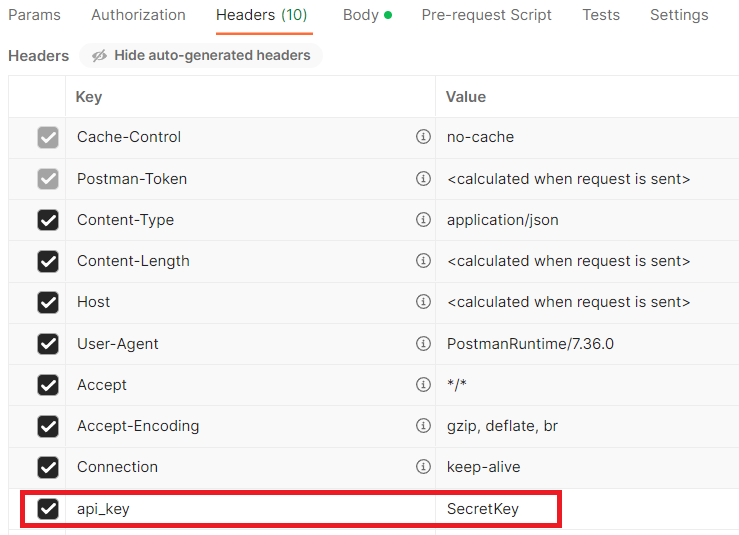
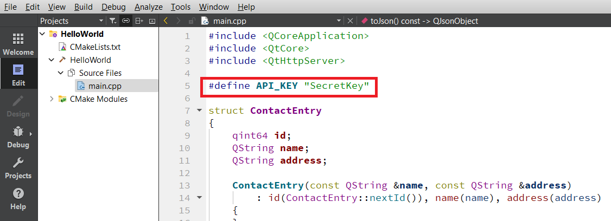

# Simple CRUD API Example using QtHttpServer with Qt C++

This example is just an API CRUD example. It's basically the example from this page: https://felgo.com/doc/qt/qthttpserver-addressbook-example/
 

## Getting Started

It's interesting you start with the example in this page: 
 - https://felgo.com/doc/qt/qthttpserver-addressbook-example/

### Prerequisites

You need a working environment with:
* [Git](https://git-scm.com) - You can install it from https://git-scm.com/downloads.
* [Qt](https://www.qt.io/download-open-source) - Install the community version.

## General Installation instructions

The best option to start with this project is cloning it in your PC:

```
git clone https://github.com/tcrurav/QtHttpServerCRUD.git
```

Open and run the project from the Qt Creator.

You can test the endpoints with the following POSTMAN:
https://documenter.getpostman.com/view/3446841/2s9YyvB1CQ

It's IMPORTANT to mention that the following header is necessary to do the POST, PUT and DELETE:


this header value must match the line in main.cpp:


Enjoy!!!

## Curl requests

GET http://127.0.0.1:49080/v2/contact
````
curl --location 'http://127.0.0.1:49080/v2/contact'
````

GET http://127.0.0.1:49080/v2/contact/1
````
curl --location 'http://127.0.0.1:49080/v2/contact/1'
````

GET http://127.0.0.1:49080
````
curl --location 'http://127.0.0.1:49080'
````

POST http://localhost:49080/v2/contact
````
curl --location 'http://localhost:49080/v2/contact' \
--header 'api_key: SecretKey' \
--data '{
    "address":"una dirección",
    "name":"tiburcio"
}'
````

PUT http://localhost:49080/v2/contact/1
````
curl --location --request PUT 'http://localhost:49080/v2/contact/1' \
--header 'api_key: SecretKey' \
--data '{
    "address":"otra cosita",
    "name":"tiburcio"
}'
````

DELETE http://localhost:49080/v2/contact/1
````
curl --location --request DELETE 'http://localhost:49080/v2/contact/1' \
--header 'api_key: SecretKey' \
--data '{
    "address":"otra cosita",
    "name":"tiburcio"
}'
````

## Built With

* [Qt Creator](https://www.qt.io/download-open-source) - Install the community version.

## Acknowledgments

* https://felgo.com/doc/qt/qthttpserver-addressbook-example/. RESTful server Address Book Example. This project is basically this example.
* https://doc.qt.io/qt-6/qthttpserver-colorpalette-example.html. RESTful API Server
* https://doc.qt.io/qt-6/qthttpserver-simple-example.html. Simple HTTP Server
* https://www.w3schools.com/cpp/. An introduction to C++.
* https://github.com/PurpleBooth/a-good-readme-template. A good README.md template.